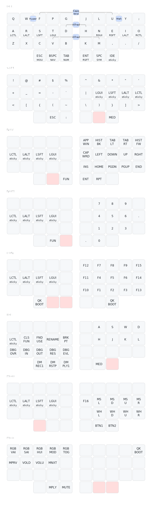

# Personal QMK userspace

This is a personal userspace repo for QMK keyboard firmware. This organization allows keeping all user keymaps self-contained in one folder rather than split across userspace and keyboard folders. Please see the README of the linked repo for more details.

To build firmware for keyboards, symbolic link a local copy or directly clone this repo into `<qmk_firmware>/users` dir. Build with:

```sh
qmk compile users/jbarr21/keymaps/<keyboard>.json
```
Build with Docker:
```sh
docker run -it --rm -w="/qmk_firmware" \
    -v $(dirname $PWD)/qmk_firmware:/qmk_firmware \
    -v $(dirname $PWD)/qmk_firmware_fingerpunch:/qmk_firmware_fingerpunch \
    -v $(dirname $PWD)/qmk_firmware_zsa:/qmk_firmware_zsa \
    -v $(dirname $PWD)/qmk_userspace:/qmk_userspace \
    qmkfm/qmk_cli /bin/bash
```

## Keymap

The keymap for above keyboards follows my ZMK keymap that you can see in my [zmk-config repo](https://github.com/jbarr21/zmk-config/).



Keymap image generated by [keymap-display](https://github.com/jbarr21/keymap-display)
